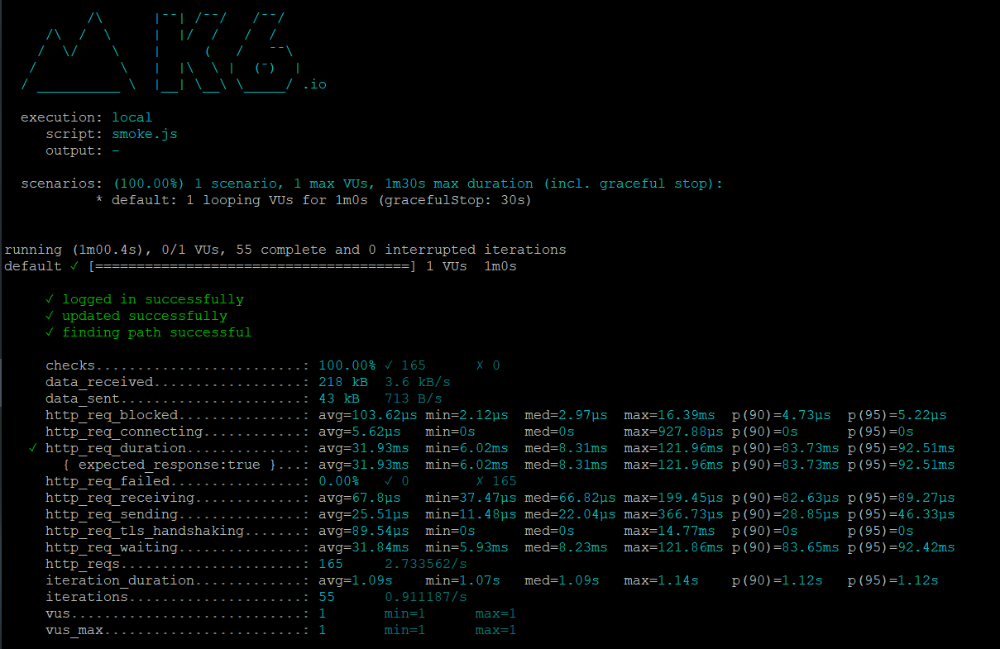
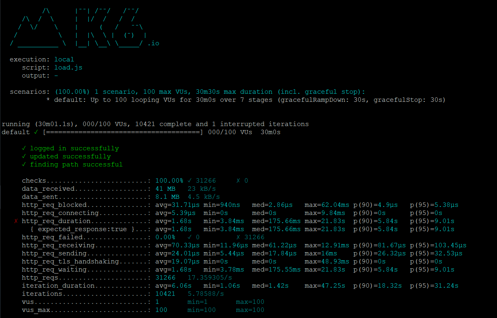
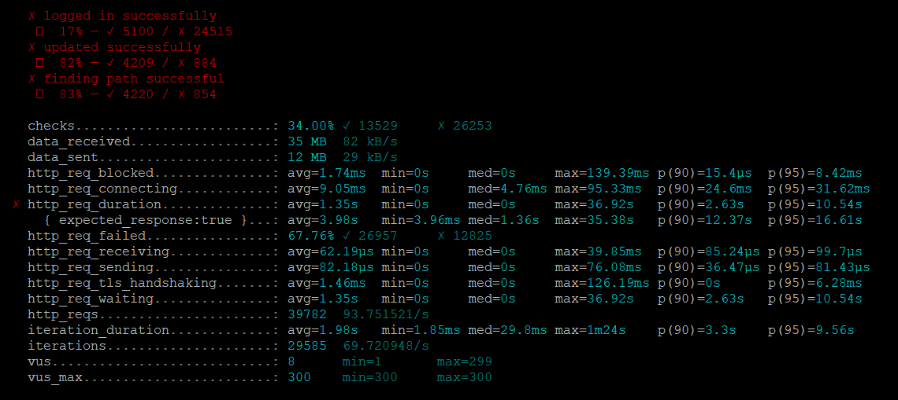

<p align="center">
    
</p>
<p align="center">
  
  
  <a href="https://edu.nextstep.camp/c/R89PYi5H" alt="nextstep atdd">
    
  </a>
  
</p>

<br>

# 인프라공방 샘플 서비스 - 지하철 노선도

<br>

## 🚀 Getting Started

### Install
#### npm 설치
```
cd frontend
npm install
```
> `frontend` 디렉토리에서 수행해야 합니다.

### Usage
#### webpack server 구동
```
npm run dev
```
#### application 구동
```
./gradlew clean build
```
<br>


### 1단계 - 웹 성능 테스트
1. 웹 성능예산은 어느정도가 적당하다고 생각하시나요
##### 모바일 
| 사이트 | First Contentful Paint | Time to Interactive | Speed Index | Total Blocking Time | Largest Contentful Paint | Cumulative Layout Shift | Score |
|-------|-------|-------|-------|-------|-------|-------|-------|
| [내사이트](https://subway-iamjunsulee.p-e.kr) | **14.6 s** | **15.2 s** | 14.6 s | 490 ms | 15.1 s | 0.042 | 33 |
| [서울교통공사](http://www.seoulmetro.co.kr/kr/cyberStation.do) | **6.7 s** | **8.7 s** | 11.1 s | 720 ms | 11 s | 0 | 32 |
| [네이버지도](https://m.map.naver.com/subway/subwayLine.naver?region=1000) | **2.2 s** | **6.3 s** | 6.2 s | 310 ms | 7.6 s | 0.03 | 57 |
| [카카오맵](https://m.map.kakao.com/) | **1.7 s** | **4.1 s** | 6.3 s | 30 ms | 5.1 s | 0.005 | 73 |

##### 데스크톱
| 사이트 | First Contentful Paint | Time to Interactive | Speed Index | Total Blocking Time | Largest Contentful Paint | Cumulative Layout Shift | Score |
|-------|-------|-------|-------|-------|-------|-------|-------|
| [내사이트](https://subway-iamjunsulee.p-e.kr) | **2.8 s** | **2.9 s** | 2.8 s | 50 ms | 2.9 s | 0.004 | 67 |
| [서울교통공사](http://www.seoulmetro.co.kr/kr/cyberStation.do) | **1.6 s** | **2.0 s** | 3.5 s | 110 ms | 3.6 s | 0.014 | 65 |
| [네이버지도](https://m.map.naver.com/subway/subwayLine.naver?region=1000) | **0.5 s** | **0.5 s** | 2.3 s | 0 ms | 1.7 s | 0.006 | 89 |
| [카카오맵](https://m.map.kakao.com/) | **0.6 s** | **2.6 s** | 2.7 s | 650 ms | 0.6 s | 0.018 | 67 |

사용자 기준에서 의미 있는 콘텐츠가 처음 보이는 시점이 빠를수록 성능이 좋다고 판단하며, 이 시점을 앞당길 수 있도록 최적화해야 합니다.  
따라서, 위 성능 비교표 기준 FCP, TTI 수치를 개선하고자 하며, 수치가 차이가 많이 나는 서울교통공사를 제외하고, 경쟁사인 네이버, 카카오의 평균 점수 대비 10% 감소를 목표로 합니다.  
- First Contentful Paint(FCP)
    - 14.6 s -> 1.75 s (모바일)
    - 2.8 s -> 0.495 (데스크톱)  
- Time to Interactive(TTI)
    - 15.2 s -> 4.68 s (모바일)  
    - 2.9 s -> 1.395 (데스크톱)
 
2. 웹 성능예산을 바탕으로 현재 지하철 노선도 서비스는 어떤 부분을 개선하면 좋을까요
- 텍스트 기반 리소스 압축(gzip, deflate, brotli)
- 캐싱 정책을 통한 정적 애셋 제공
- 지연로딩을 사용하여 렌더링 차단 리소스 제거하기

##### 용어사전
- First Contentful Paint(FCP): 첫 번째 텍스트 또는 이미지가 표시되는 시간
- Time to Ineractive(TTI): 완전히 페이지와 상호작용할 수 있게 될 때까지 걸리는 시간
- Speed Index(SI): 페이지 콘텐츠가 얼마나 빨리 표시되는지를 나타낸다.
- Total Blocking Time(TBT): FCP와 TTI 시간 사이의 모든 시간의 합
- Largest Contentful Paint(LCP): 최대 텍스트 또는 이미지가 표시되는 시간
- Cumulative Layout Shift(CLS): 사용자 입력 500ms 이내에 발생하지 않는 레이아웃 이동에 대한 점수를 합산하여 콘텐츠의 불안정성을 측정한다.

---

### 2단계 - 부하 테스트 
1. 부하테스트 전제조건은 어느정도로 설정하셨나요
#### 대상 시스템 범위
- nginx, application, db

#### 목표값 설정 (latency, throughput, 부하 유지기간)
- 예상 수치 설정
    - 예상 1일 사용자수(DAU) : 200 만  
        - 20220703 데이터 승/하차객 수 중 50% 사용한다고 가정
        (참고자료 : [서울시 지하철호선별 역별 승하차 인원 정보](https://data.seoul.go.kr/dataList/OA-12914/S/1/datasetView.do))
    - 피크 시간대의 집중률  : 4.0
        - 피크 시간대(오전 6 ~ 9시, 오후 5 ~ 8시) 이용률 40%
        (참고자료 : [서울시 지하철 호선별 역별 시간대별 승하차 인원 정보](https://data.seoul.go.kr/dataList/OA-12252/S/1/datasetView.do))
    - 1명당 1일 평균 접속 혹은 요청수
        - 출, 퇴근시 각각 1번씩 사용한다고 가정
        - 사용 시, 로그인, 내 정보 수정, 경로 검색 3회 요청한다고 가정
- throughput
    - 1일 총 접속 수 = 1일 사용자 수(DAU) x 1명당 1일 평균 접속 수 =  200만 x 2 = 400만
    - 1일 평균 rps = 1일 총 접속 수 / 86,400 (초/일) = 400만 / 86,400 = 46.29
    - 1일 최대 rps = 1일 평균 rps x (최대 트래픽 / 평소 트래픽) =  185.16
    - VUser = (46.29 x 1.5s) x 3 = 23
    - VUser = (185.16 x 1.5s) x 3 = 92
- latency
    - 100ms 이하
- 부하유지시간
    - smoke test : 1 m
    - stress test : 7 m
    - load test : 30 m
    
#### 부하 테스트 시 저장될 데이터 건수 및 크기
- 지하철 노선 : 23
- 지하철 구간 : 340
- 지하철 역 : 616

2. Smoke, Load, Stress 테스트 스크립트와 결과를 공유해주세요
- 접속 빈도가 높은 페이지 : 로그인
- 데이터를 갱신하는 페이지 : 내 정보 수정
- 데이터를 조회하는데 여러 데이터를 참조하는 페이지 : 경로 검색

#### Smoke test

```js
import http from 'k6/http';
import { check, sleep } from 'k6';

export let options = {
    vus: 1, // 1 user looping for 1 minute
    duration: '1m',

    thresholds: {
        http_req_duration: ['p(99)<1500'], // 99% of requests must complete below 1.5s
    },
};

const BASE_URL = 'https://subway-iamjunsulee.p-e.kr/';
const USERNAME = 'test@naver.com';
const PASSWORD = '1234';

export default function ()  {
    let token = login();

    let authHeaders = {
        headers: {
            Authorization: `Bearer ` + token,
            'Content-Type': 'application/json'
        },
    };

    update(authHeaders);

    findPath(1, 4);

    sleep(1);
};

function login() {
    let loginUrl = `${BASE_URL}/login/token`;

    let loginPayload = JSON.stringify({
        email: USERNAME,
        password: PASSWORD,
    });

    let loginParams = {
        headers: {
            'Content-Type': 'application/json'
        },
    };

    let loginResponse = http.post(loginUrl, loginPayload, loginParams);

    check(loginResponse, {
        'logged in successfully': (response) => response.json('accessToken') !== '',
    });
    return loginResponse.json('accessToken');
}

function update(authHeaders) {
    let updateRequest = JSON.stringify({
        email: USERNAME,
        password: PASSWORD,
        age: 33,
    });

    let updateResponse = http.put(`${BASE_URL}/members/me`, updateRequest, authHeaders);
    check(updateResponse, { 'updated successfully': (response) => response.status === 200});
}

function findPath(source, target) {
    let pathResponse = http.get(`${BASE_URL}/paths?source=${source}&target=${target}`);
    check(pathResponse, { 'finding path successful': (response) => response.status === 200});
}
```
#### Load test

```js
import http from 'k6/http';
import { check, sleep } from 'k6';

export let options = {
    stages: [
        { duration: '5m', target: 25 },
        { duration: '5m', target: 25 },
        { duration: '3m', target: 100 },
        { duration: '2m', target: 100 },
        { duration: '3m', target: 25 },
        { duration: '10m', target: 25 },
        { duration: '2m', target: 0 },
    ],

    thresholds: {
        http_req_duration: ['p(99)<1500'], // 99% of requests must complete below 1.5s
    },
};

const BASE_URL = 'https://subway-iamjunsulee.p-e.kr/';
const USERNAME = 'test@naver.com';
const PASSWORD = '1234';

export default function ()  {
    let token = login();

    let authHeaders = {
        headers: {
            Authorization: `Bearer ` + token,
            'Content-Type': 'application/json'
        },
    };

    update(authHeaders);

    findPath(1, 4);

    sleep(1);
};

function login() {
    let loginUrl = `${BASE_URL}/login/token`;

    let loginPayload = JSON.stringify({
        email: USERNAME,
        password: PASSWORD,
    });

    let loginParams = {
        headers: {
            'Content-Type': 'application/json'
        },
    };

    let loginResponse = http.post(loginUrl, loginPayload, loginParams);

    check(loginResponse, {
        'logged in successfully': (response) => response.json('accessToken') !== '',
    });
    return loginResponse.json('accessToken');
}

function update(authHeaders) {
    let updateRequest = JSON.stringify({
        email: USERNAME,
        password: PASSWORD,
        age: 33,
    });

    let updateResponse = http.put(`${BASE_URL}/members/me`, updateRequest, authHeaders);
    check(updateResponse, { 'updated successfully': (response) => response.status === 200});
}

function findPath(source, target) {
    let pathResponse = http.get(`${BASE_URL}/paths?source=${source}&target=${target}`);
    check(pathResponse, { 'finding path successful': (response) => response.status === 200});
}
```
#### Stress test

```js
import http from 'k6/http';
import { check, sleep } from 'k6';

export let options = {
    stages: [
        { duration: '1m', target: 25 },
        { duration: '1m', target: 100 },
        { duration: '1m', target: 200 },
        { duration: '1m', target: 500 },
        { duration: '1m', target: 200 },
        { duration: '1m', target: 100 },
        { duration: '1m', target: 25 },
    ],

    thresholds: {
        http_req_duration: ['p(99)<1500'], // 99% of requests must complete below 1.5s
    },
};

const BASE_URL = 'https://subway-iamjunsulee.p-e.kr/';
const USERNAME = 'test@naver.com';
const PASSWORD = '1234';

export default function ()  {
    let token = login();

    let authHeaders = {
        headers: {
            Authorization: `Bearer ` + token,
            'Content-Type': 'application/json'
        },
    };

    update(authHeaders);

    findPath(1, 4);

    sleep(1);
};

function login() {
    let loginUrl = `${BASE_URL}/login/token`;

    let loginPayload = JSON.stringify({
        email: USERNAME,
        password: PASSWORD,
    });

    let loginParams = {
        headers: {
            'Content-Type': 'application/json'
        },
    };

    let loginResponse = http.post(loginUrl, loginPayload, loginParams);

    check(loginResponse, {
        'logged in successfully': (response) => response.json('accessToken') !== '',
    });
    return loginResponse.json('accessToken');
}

function update(authHeaders) {
    let updateRequest = JSON.stringify({
        email: USERNAME,
        password: PASSWORD,
        age: 33,
    });

    let updateResponse = http.put(`${BASE_URL}/members/me`, updateRequest, authHeaders);
    check(updateResponse, { 'updated successfully': (response) => response.status === 200});
}

function findPath(source, target) {
    let pathResponse = http.get(`${BASE_URL}/paths?source=${source}&target=${target}`);
    check(pathResponse, { 'finding path successful': (response) => response.status === 200});
}
```
---

### 3단계 - 로깅, 모니터링
1. 각 서버내 로깅 경로를 알려주세요

2. Cloudwatch 대시보드 URL을 알려주세요
